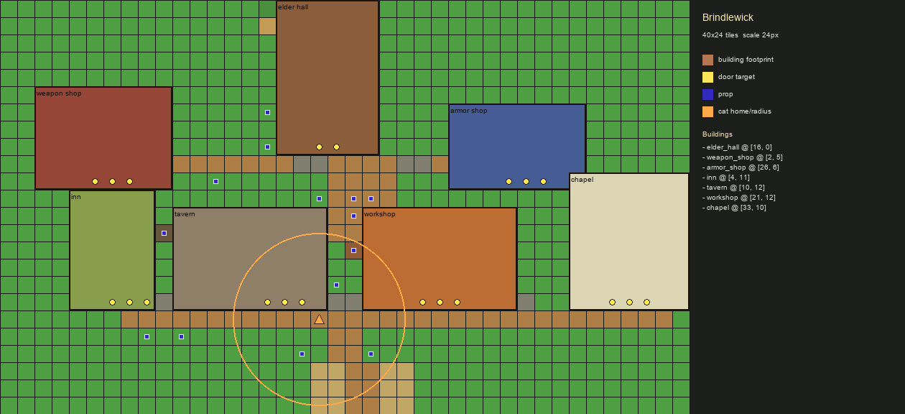

# Town World Data

Lanternhouse town layouts live here as data files. Edit layout JSON first, then
run the world-art pipeline before touching scene code:

```powershell
python scripts/dev/build_world_art.py
```

The pipeline validates every `*.layout.json` file in this directory, checks town
layout shape, door approach tiles, building footprints, prop placement, and
atlas/runtime drift, then renders matching `*.preview.png` files.

Create a starter town layout with:

```powershell
python scripts/dev/create_town_layout.py mournlight_harbor --name "Mournlight Harbor"
```

That creates `mournlight_harbor.layout.json`, runs the world-art pipeline, and
renders `mournlight_harbor.preview.png`.

Add or replace a building without hand-editing door/interact data:

```powershell
python scripts/dev/add_town_building.py smithy --name "Smithy" --npc weapon_merchant --x 10 --y 8 --width 6 --height 4 --plaque plaque_sword --door-width 3 --sign --awning
```

The tool writes the building footprint, interaction target, door tiles, and
optional shop sign/awning, then runs the world-art pipeline unless
`--skip-build` is passed.

## Brindlewick

- Layout: `brindlewick.layout.json`
- Preview: `brindlewick.preview.png`



Preview legend:

- Building footprints are translucent colored blocks.
- Yellow dots are door targets.
- Blue squares are props.
- Orange triangle/ring marks the cat home and wander radius.
